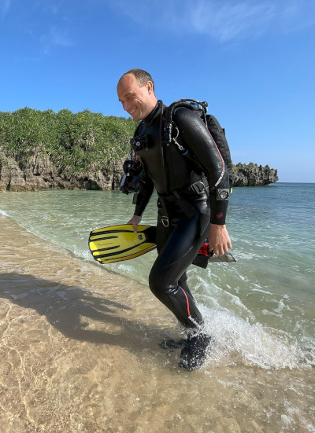

---
# the default layout is 'page'
icon: fas fa-info-circle
order: 4
---

Hi!
{: width="250" .right .shadow}
My name is Anže Abram (アブラム・アンジェ). I am a postdoctoral follow at [Department for Nanostractured Materials](https://nano.ijs.si/) at [Jozef Stefan Institute](https://www.ijs.si/), Slovenia  and [Politecnico di Torino](https://www.polito.it/), Italy.

My research interests are biomaterials, especially bioceramics and bioresorbable materials for marine-environment applications. My expertise lies in material synthesis, surface characterisation and electron microscopy. I am also versed in scientific diving.

I teach part-time at [Faculty of Health Sciences, University of Ljubljana](https://www.zf.uni-lj.si/en/) for the course 'Laboratory dental prosthetics'.

I received my bachelor's degree in Material Science at [University of Ljubljana](https://www.uni-lj.si/en/university) in 2012. I received my PhD in Nanoscience and Nanotechnologies at [Jožef Stefan International Postgraduate School (IPS)](https://mps.si/en/) in 2017. In 2022 I was awarded [JSPS Postdoctoral Fellowships for Research in Japan](https://www.jsps.go.jp/english/e-fellow/) which allowed me to work in the **Molecular Invertebrate Systematics and Ecology Laboratory (MISE)** at the [University of the Ryukyus, Okinawa, Japan](https://www.u-ryukyu.ac.jp/en/).

I spend my free time running, hiking and cave diving. More about cave cartography projects can be found [here](https://github.com/anzeabram/SiCS).

